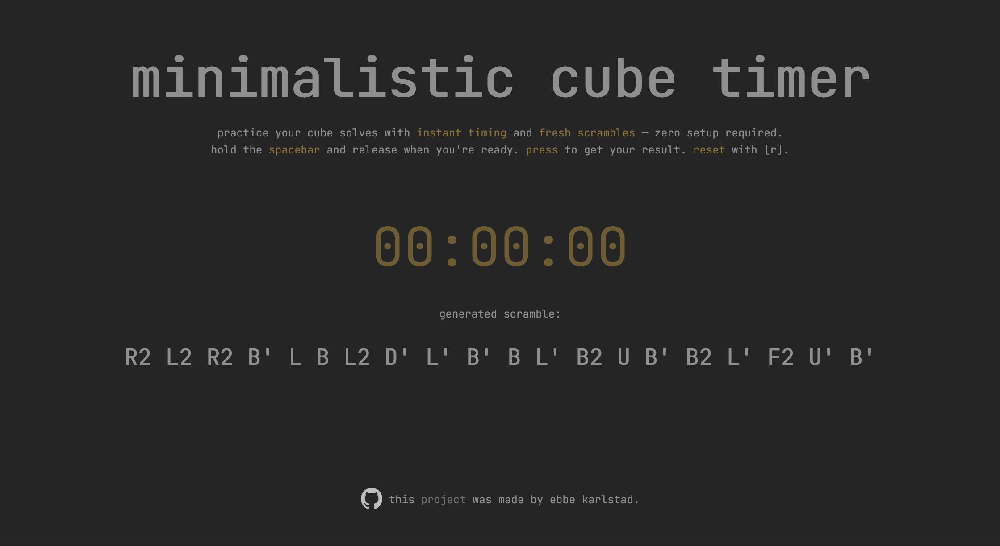

# Minimalistic Cube Timer

This is a simple, keyboard-driven timer for speedcubing practice with generated scrambles. Made for practice and fun 😊



## Installation
1. Clone repository:
```bash
   git clone https://github.com/ebbekarlstad/cubetimer.git
   ```
2.  Install dependencies:
```bash
   npm install
   git clone https://github.com/ebbekarlstad/cubetimer.git
   ```
3.  Start server:
```bash
   node server.js
   ```
    
4.  Open `http://localhost:8080` in your browser.
    

## Usage

-   **Spacebar**: Start/stop timer
    
-   **R**: Reset timer
    

## License
[The MIT License (MIT)](https://mit-license.org/)
